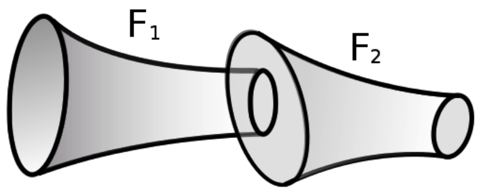
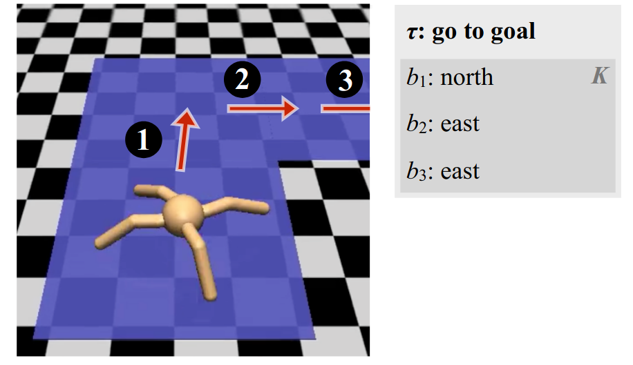

[comment]: # (compile this presentation with markdown-slides)

# The case for modular policies

[comment]: # (!!!)

**(Approximate) Problem statement**

Find a state-space policy that can accomplish a set of (possibly unseen)
"mission plans".

(*take off to 100m, cruise for 1500m, etc.*)

[comment]: # (!!!)

Goal: UAV control for a fixed robot design.

| Input | Output |
|-------|--------|
| Structured way-point sequences | Mapping from observations to actions |

[comment]: # (!!!)

How (and why) should we use a library of primitive policies for robust control?

[comment]: # (!!!)

Selected prior art:

- Majumdar and Tedrake, **Funnel Libraries for Real-Time Robust Feedback Motion
	Planning**, 2017.

- Andreas and Klein and Levine, **Modular Multitask Reinforcement Learning with
	Policy Sketches**, 2017.

[comment]: # (!!!)

 <!-- .element: style="height:50vh; max-width:80vw;" -->

(Majumdar and Tedrake, 2017)

[comment]: # (!!!)

 <!-- .element: style="height:50vh; max-width:80vw;" -->

(Andreas and Klein and Levine, 2017)

[comment]: # (!!!)

Specific key takeaways:

- Characterization of sequential composition as a property of reachable sets.

- Execution of symbolic plans composed of sub-tasks.

[comment]: # (!!!)

Library policies pros:

- Cheaper than designing a global control law.

- More robust than single trajectory plans.

- Capability can be increased by extending library.

- Limits of the system can be understood.

- Control theory + ML = best of multiple worlds.

[comment]: # (!!!)

**Input:** set of structured way-point sequences.

**Output:** state-space modular policy.

1. Primitive policy set: parametrized policies (state + target to actions).

2. Library optimization: find primitive modules for each sub-task.

3. Return the library (equipped with the required run-time algorithms).

[comment]: # (!!!)
